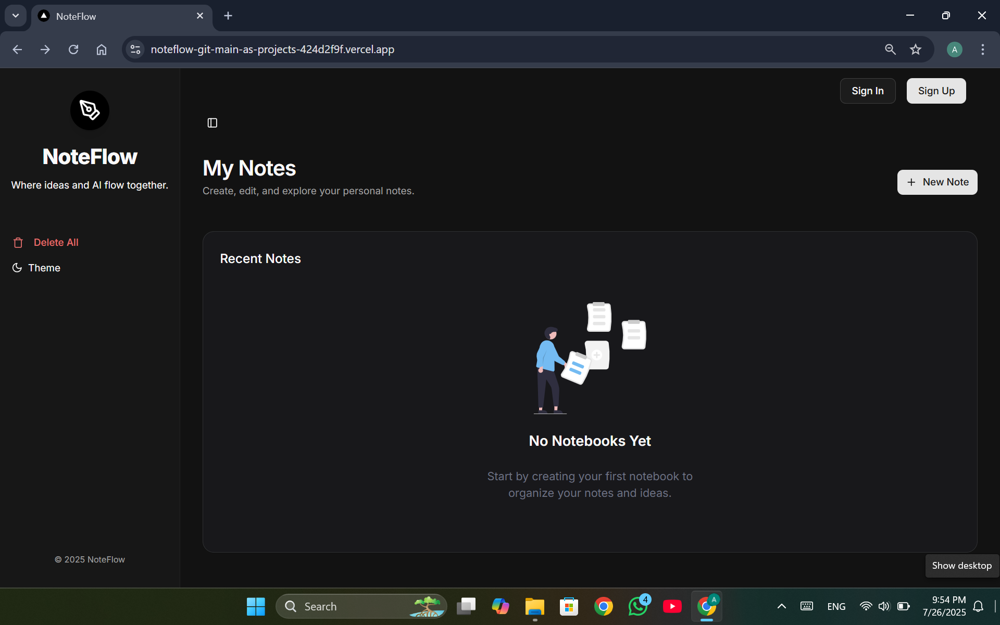
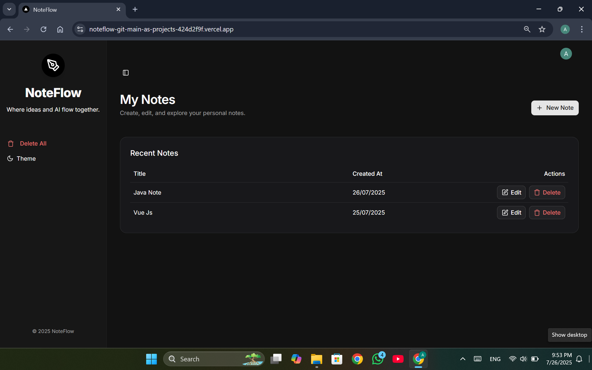
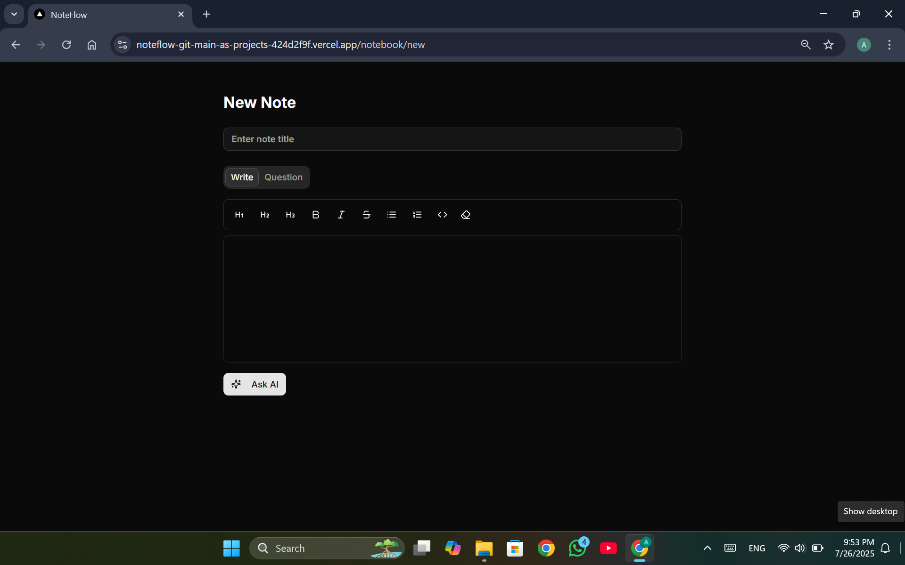
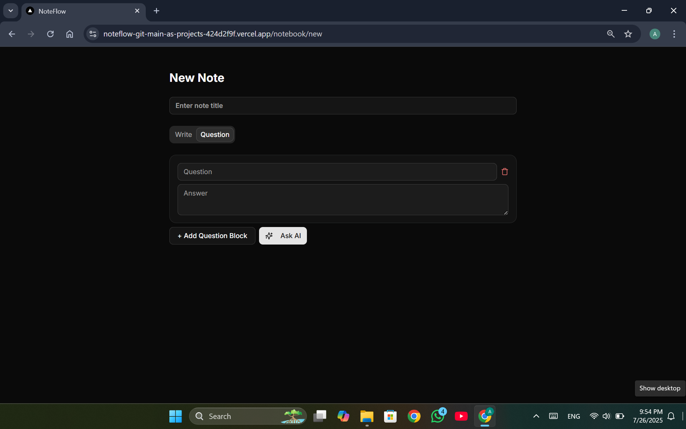
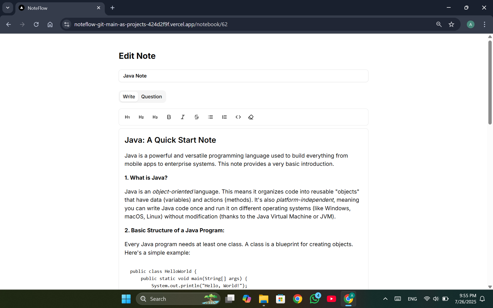

# NoteFlow

NoteFlow is a modern note-taking web application powered by Next.js, Clerk authentication, Drizzle ORM, and AI integration (Google Gemini). It enables users to create, edit, and manage notebooks, ask AI questions, and organize notes efficiently.

## Features

- User authentication (sign-in/sign-up) via Clerk
- Create, edit, and delete notebooks
- Rich text note editor with markdown support
- AI-powered Q&A blocks using Google Gemini
- Responsive sidebar navigation
- Dark/light theme toggle
- Bulk delete notebooks
- Mobile-friendly UI

## Tech Stack
- **Frontend:** Next.js 14+, React, Tailwind CSS, Shadcn UI
- **Authentication:** Clerk
- **Database:** PostgreSQL (via Drizzle ORM)
- **ORM:** Drizzle ORM
- **AI Integration:** Google Gemini API
- **State Management:** React Context
- **Icons:** Lucide React
- **Animations:** Motion.dev

## Folder Structure

```
app/                # Next.js app directory
  (auth)/           # Authentication pages
  (main)/           # Main app layout and pages
  api/              # API routes (Gemini, Notebooks)
  notebook/         # Notebook editor page
components/         # Reusable UI and app components
context/            # React context providers
db/                 # Database schema and connection
drizzle/            # Drizzle migration files
hooks/              # Custom React hooks
lib/                # Utility functions and AI logic
public/             # Static assets
types/              # TypeScript types
```

## Getting Started

### Prerequisites

- Node.js 18+
- PostgreSQL database
- Clerk account (for authentication)
- Google Gemini API access

### Installation

1. **Clone the repository:**
   ```powershell
   git clone <https://github.com/asathsara/noteflow.git>
   cd noteflow
   ```

2. **Install dependencies:**
   ```powershell
   npm install
   ```

3. **Configure environment variables:**
   - Create a `.env.local` file in the root directory.
   - Add your Gemini API key and Clerk credentials:
     ```
     GOOGLE_GENERATIVE_AI_API_KE=your_api_key
     NEXT_PUBLIC_CLERK_PUBLISHABLE_KEY=your_clerk_key
     CLERK_SECRET_KEY=your_clerk_secret
     ```

    - Create a `.env` file in the root directory.
    - Add Neon credentials

      ```
      DATABASE_URL=your_postgres_url
      ```

4. **Run database migrations:**
   ```powershell
   npm run drizzle:migrate
   ```

5. **Start the development server:**
   ```powershell
   npm run dev
   ```

6. **Access the app:**
   - Open [http://localhost:3000](http://localhost:3000) in your browser.

## Usage

- **Sign Up / Sign In:** Use Clerk authentication to access your notebooks.
- **Create a Notebook:** Click "New Note" to start a notebook.
- **Edit Notes:** Use the rich text editor and add Q&A blocks.
- **Ask AI:** Use the AI dialog to get answers powered by Gemini.
- **Delete Notebooks:** Use the sidebar to bulk delete all notebooks.
- **Theme Toggle:** Switch between dark and light modes.

## API Endpoints

- `POST /api/gemini`: Ask AI questions (Google Gemini)
- `GET/PUT/DELETE /api/notebooks/[id]`: Manage notebooks

## Screenshots

Here are some screenshots showcasing NoteFlow's UI and features:

### Home Page


### Notebooks List


### Note Editor


### AI Question Block


### Light Theme Note Editor
